# 第二十届 D2 - 从上下文工程到 Harness Engineering -- 分享人周晓

> 分享人：周晓 | Web Infra AI Coding 负责人
> 第二十届 D2 技术大会 · 2026.03.21 · 阿里巴巴全球总部

- PDF：[第二十届 d2-从上下文工程到 Harness Engineering-zhouxiao.pdf](https://github.com/zhoushaw/Context-Engineering-to-Harness-Engineering/blob/main/%E7%AC%AC%E4%BA%8C%E5%8D%81%E5%B1%8A%20d2-%E4%BB%8E%E4%B8%8A%E4%B8%8B%E6%96%87%E5%B7%A5%E7%A8%8B%E5%88%B0%20Harness%20Engineering-zhouxiao.pdf)
- 视频：[从上下文工程到 Harness Engineering-周晓.mp4](https://github.com/zhoushaw/Context-Engineering-to-Harness-Engineering/blob/main/%E4%BB%8E%E4%B8%8A%E4%B8%8B%E6%96%87%E5%B7%A5%E7%A8%8B%E5%88%B0%20Harness%20Engineering-%E5%91%A8%E6%99%93.mp4)

---

## 封面

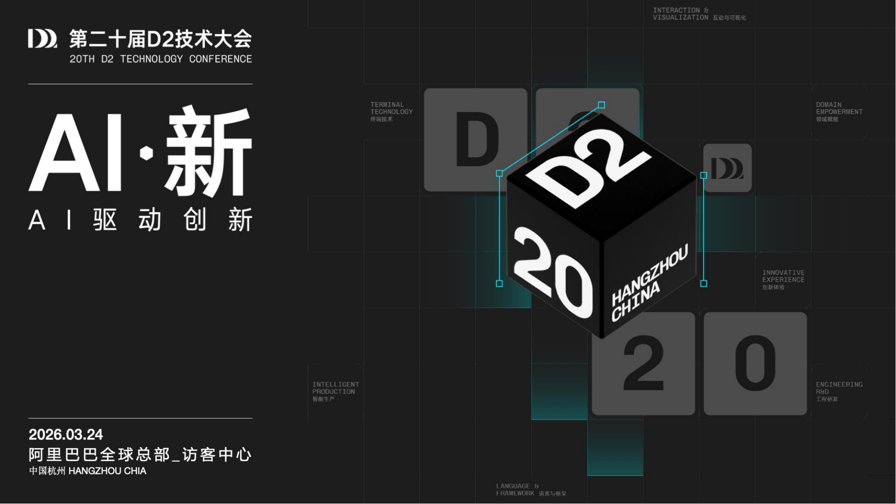

第二十届 D2 技术大会，主题「AI · 新 — AI 驱动创新」，2026 年 3 月 21 日，杭州阿里巴巴全球总部访客中心。

---

## 从上下文工程到 Harness Engineering

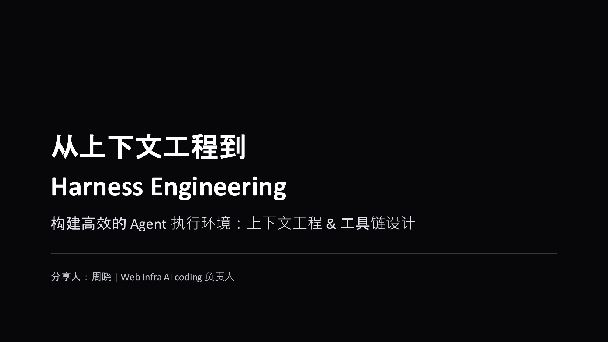

大家上午好！这是我第一次来 D2，还是挺紧张的，因为担心没有办法给大家带来一些干货。希望今天这场分享能给大家带来一些收获。

如果大家有关注的话就会发现我的演讲主题做了一些调整——原来是「AI-Driven Loop」，现在变成了「Harness Engineering」。我想先给大家提个问题：有多少人了解过 Harness Engineering，并且将它实际运用过？如果可以的话可以帮忙举个手。都不知道吗？那今天的分享你应该来对地方了。我觉得今天的分享应该能给大家带来一些收获，能够帮助大家了解在 AI 时代怎么样提高自己的工程力。

好，这是我今天分享的主题：从上下文工程到 Harness Engineering。今天我的分享不聊框架，也不聊产品，我聊一聊大家可以带走哪些有收获的想法，帮助大家提提高一下生产力。

---

## About Me

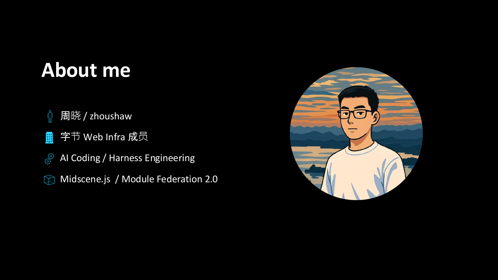

我是来自字节 Web Infra 团队的周晓（zhoushaw），目前在负责 AI Coding 相关的一些工作。之前我也开源过两个产品——一个是 Midscene.js，另外一个是 Module Federation 2.0。相信大家有可能听过或者用过这两个产品。

---

## AI 时代的研发焦虑与反思

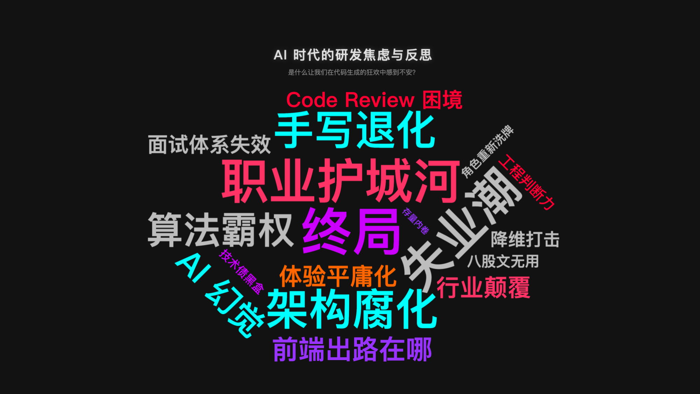

在开始前先给大家看一个词云。这个词云来自我们团队举办的一个年终活动，当时公司里面的同事提了非常多的问题，我从这些问题里面提取了一些关键词。可以看得出来大家非常焦虑——明明现在 AI Coding 已经这么强大了，代码生成速度这么快的情况下，为什么我们反而感觉到更不安了？前端的出路在哪里？我们的护城河又是什么？我相信大家一直在思考这些问题。

---

## 为什么 AI 出现后，研发普遍觉得更累了？

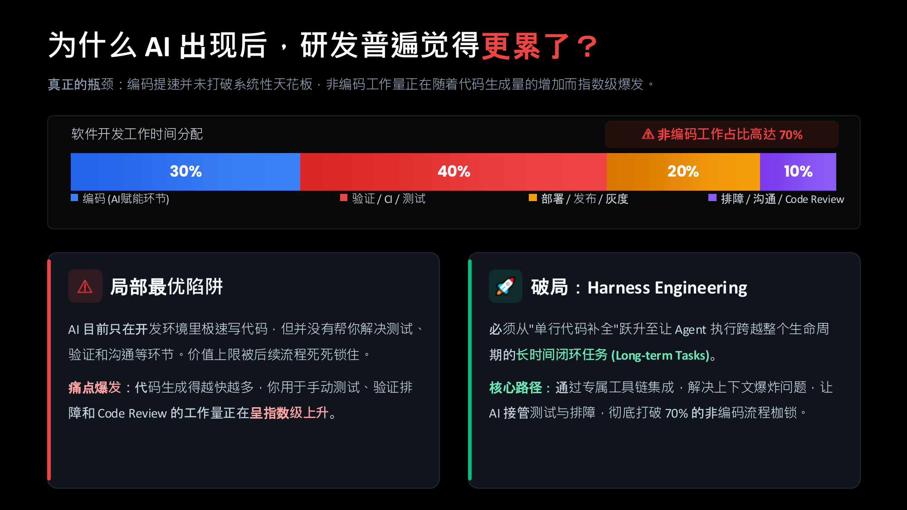

说一个反直觉的现象：很多同事跟我反馈说，为什么 AI Coding 出来之后大家反而感觉更累了？

说一说我的看法。原因在于 AI Coding 确实让大家的代码生成速度提高了一个数量级，但是它并没有让产品交付的速度变快。核心原因是现在大家更多地在使用 AI Coding 做写代码的工作，但它并没有帮助大家来测试、验证和沟通。反而人成为了这个过程中最大的瓶颈——因为 AI 写完代码之后，你会发现你需要去帮它 Review 代码，你需要去帮它做测试，你的工作量指数级上升。

真正的瓶颈在于：编码提速并未打破系统性天花板，非编码工作量正在随着代码生成量的增加而指数级爆发。软件开发工作时间分配中，编码只占 30%（AI 赋能环节），而验证/QA/测试占 40%，部署/发布/灰度占 20%，排障/沟通/Code Review 占 10%——非编码工作占比高达 70%。

**局部最优陷阱**：AI 目前只在开发环境里极速写代码，但并没有帮你解决测试、验证和沟通等环节，价值上限被后续流程死死锁住。

**破局：Harness Engineering** — 必须从「单行代码补全」跃升至让 Agent 执行跨越整个生命周期的长时间闭环任务（Long-term Tasks）。核心路径是通过专属工具链集成，解决上下文爆炸问题，让 AI 接管测试与排障，彻底打破 70% 的非编码流程枷锁。

---

## 范式转移：什么是 Harness Engineering？

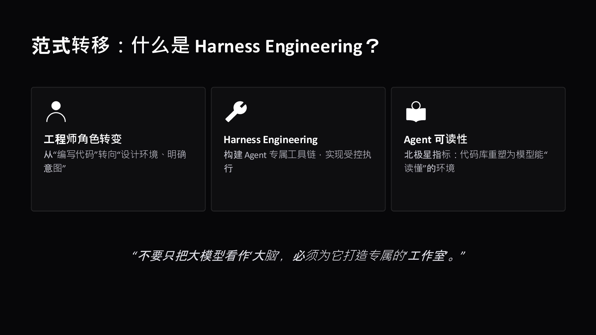

那怎么解决这个问题呢？前段时间 OpenAI 发了一篇技术文章叫 Harness Engineering，其实它已经提供了一个非常好的指引，告诉大家该怎么解决这个问题。

首先聊一聊比较核心的范式转移。大家都知道都在用 Cursor、都在用 Claude Code，那为什么在这个过程中，作为工程师我应该扮演什么角色？

从 Cursor 为代表的代码补全，再到 Claude Code 为代表的 Agentic Coding，再到今天——其实每一个前沿的模型厂商和 AI Coding 工具都在解决一件事情：**怎么样让任务运行得更长**。

作为研发工程师，非常大的一个变化就是我们从过去写代码的人，变成了给 Agent 设计环境、设计反馈的人。Harness 的意思是「马具」——我们应该从使用模型的人，变成驾驭模型的人。

三个核心维度：

- **工程师角色转变**：从「编写代码」转向「设计环境、明确意图」
- **Harness Engineering**：构建 Agent 专属工具链，实现受控执行
- **Agent 可读性**：北极星指标——代码库重塑为模型能「读懂」的环境

> 「不要只把大模型看作'大脑'，必须为它打造专属的'工作室'。」

---

## PART 01：唯快不破 — 从 Transformer 原理到 Prompt Cache

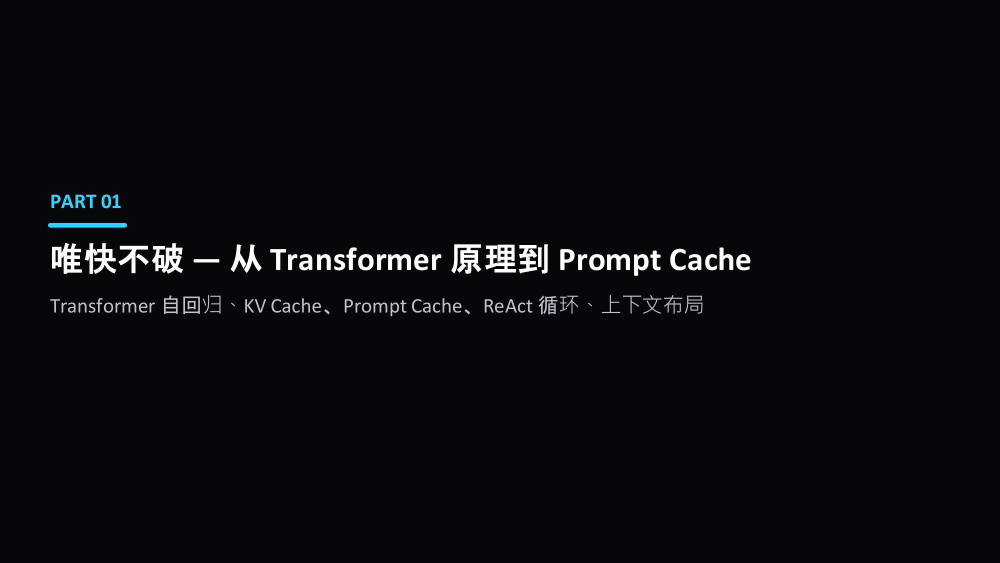

涵盖内容：Transformer 自回归、KV Cache、Prompt Cache、ReAct 循环、上下文布局。

大家过去都在聊各种框架、在聊 Claude Code、在聊 Codex，那这些产品它的底层原理是什么？今天我不聊这些框架和产品，我来聊一聊到底这些底层模型是在遵循哪一些物理规律。

大家会有一个非常感同身受的感觉：为什么大家都在用 Cursor，有的人产出是其他同事的十倍？核心原因在于大家对于怎么样使用好 AI Coding，每个人都有自己的认知和想法。我希望通过今天 D2 的分享，来给大家深挖一下底层原理到底是什么。

---

## Claude Code / Codex 在遵循哪些「物理限制」？

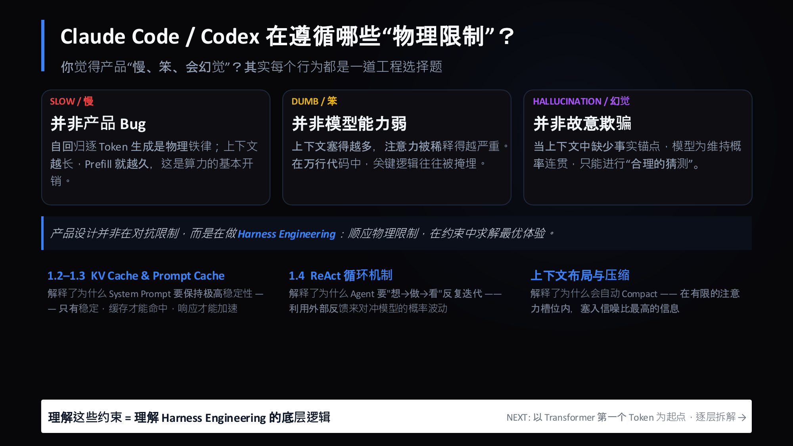

你觉得产品「慢、笨、会幻觉」？其实每个行为都是一道工程选择题。

- **SLOW / 慢 — 并非产品 Bug**：自回归逐 Token 生成是物理铁律；上下文越长，Prefill 就越久，这是算力的基本开销。
- **DUMB / 笨 — 并非模型能力弱**：上下文塞得越多，注意力被稀释得越严重。在万行代码中，关键逻辑往往被掩埋。
- **HALLUCINATION / 幻觉 — 并非故意欺骗**：当上下文中缺少事实锚点，模型为维持概率连贯，只能进行「合理的猜测」。

> 产品设计并非在对抗限制，而是在做 Harness Engineering：顺应物理限制，在约束中求解最优体验。

理解这些约束 = 理解 Harness Engineering 的底层逻辑。

---

## 1.1 为什么是一个 token 一个 token 吐？

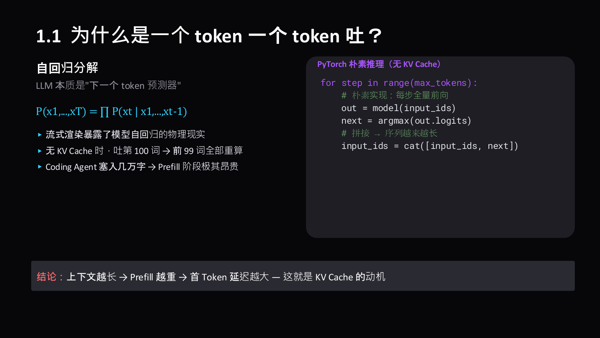

从 ChatGPT 2022 年底出来之后，大家会发现为什么这个产品是流式输出的？为什么它要一个字一个字地输出？难道仅仅是为了产品更像人吗？其实不是的。

核心在于今天的大模型是基于 Transformer 的架构。Transformer 架构里面有一个非常核心的机制叫做「预测下一个 Token」。这代表着每一个 Token 预测都是基于前面的 Token 来生成下一个 Token 的概率。

**自回归分解**：LLM 本质是「下一个 token 预测器」，公式 P(x1,...,xT) = ∏ P(xt | x1,...,xt-1)。

关键要点：
- 流式渲染暴露了模型自回归的物理现实
- 无 KV Cache 时，吐第 100 词 → 前 99 词全部重算
- Coding Agent 塞入几万字 → Prefill 阶段极其昂贵

**结论：上下文越长 → Prefill 越重 → 首 Token 延迟越大 — 这就是 KV Cache 的动机。**

---

## 1.2 KV Cache：为什么「追加」便宜？

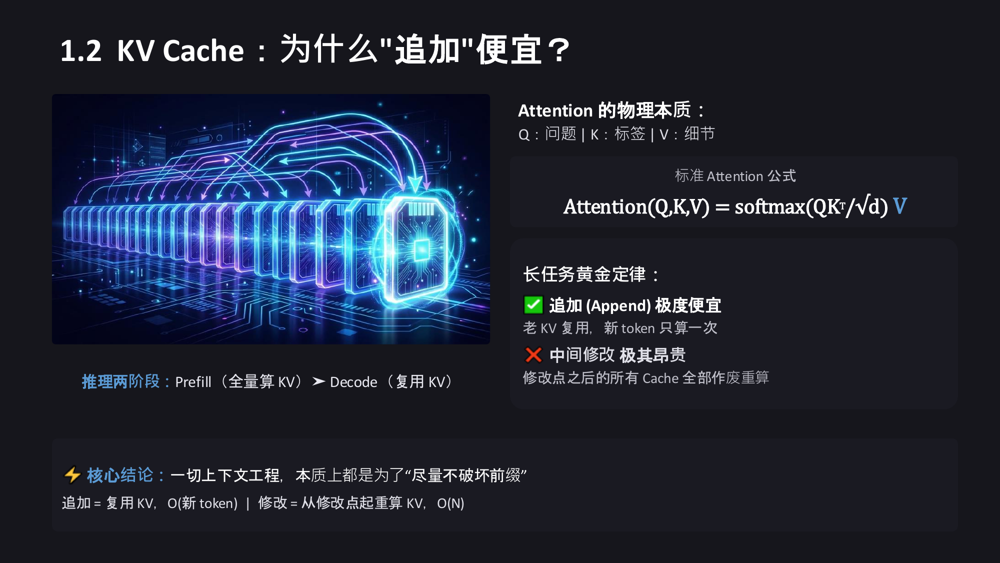

KV Cache 的核心其实很简单——在模型推理的循环中，我们怎么样让这个循环成本更低？

**Attention 的物理本质**：Q 是问题 | K 是标签 | V 是细节。标准 Attention 公式：Attention(Q,K,V) = softmax(QK^T/√d) V。

推理分两阶段：Prefill（全量算 KV） → Decode（复用 KV）。

**长任务黄金定律**：
- ✅ **追加 (Append) 极度便宜**：老 KV 复用，新 token 只算一次
- ❌ **中间修改极其昂贵**：修改点之后的所有 Cache 全部作废重算

**核心结论：一切上下文工程，本质上都是为了「尽量不破坏前缀」。** 追加 = 复用 KV，O(新 token) | 修改 = 从修改点起重算 KV，O(N)。

---

## 1.3 Prompt Cache：多快省

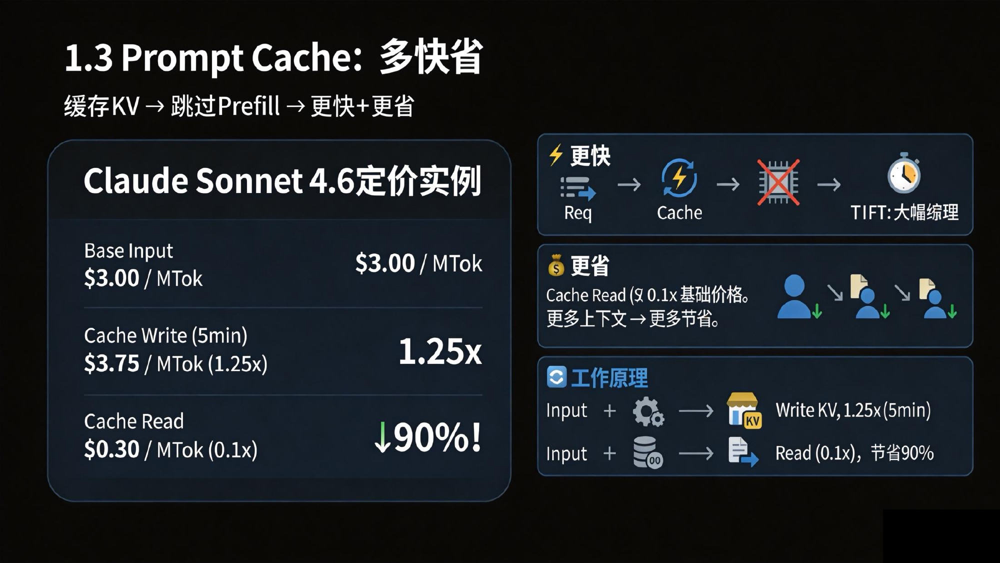

聊一个非常现实的问题：我怎么样让我的 AI Coding 工具的成本更低、解决更多的问题？核心也是 KV Cache。

以 Claude Sonnet 4.6 定价为例：当你命中 Prompt Cache 的时候，你的成本能降低 90%，并且推理速度也有非常大的提升。核心原理很简单——大家都是专业的编程工程师，都知道尽量地复用缓存必然会让你的代码跑得更快，在模型推理上也是一样的道理。

- **更快**：缓存 KV → 跳过 Prefill → TTFT（首 Token 时间）大幅缩短
- **更省**：Cache Read 仅 0.1x 基础价格，更多上下文 → 更多节省
- Base Input: $3.00/MTok → Cache Write (5min): $3.75/MTok (1.25x) → Cache Read: $0.30/MTok (0.1x) — **降低 90%！**

---

## 1.4 ReAct：Agent 的操作系统

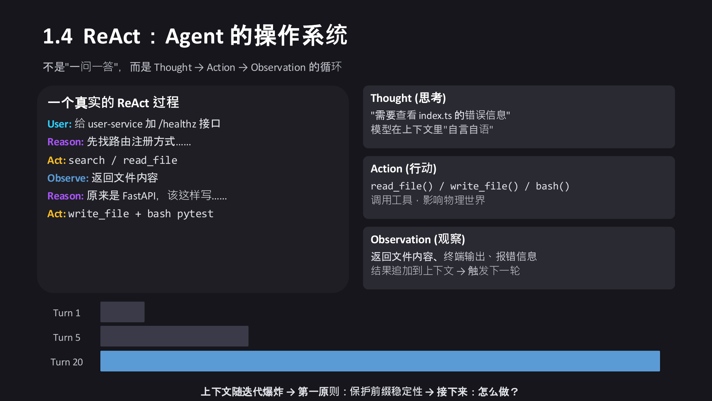

到这里大家会思考一个问题：今天的 AI Coding 产品以及所有的 Agent 产品，它为什么长这个模样？其实在 2022 年 ChatGPT 出来前，有一篇非常知名的论文叫 ReAct。它定义了今天 Agent 是什么样的。

这篇论文的核心就是：如果大模型已经足够聪明了，那我怎么样让它解决现实世界、物理世界的问题？核心是像一个人一样——我能够感知到当前的状态，然后预测下一步行动，去行动，拿到结果。这样就形成一个循环，Agent 就能解决实际问题了。

不是「一问一答」，而是 Thought → Action → Observation 的循环：

- **Thought (思考)**：「需要查看 index.ts 的错误信息」— 模型在上下文里「自言自语」
- **Action (行动)**：read_file() / write_file() / bash() — 调用工具，影响物理世界
- **Observation (观察)**：返回文件内容、终端输出、报错信息 — 结果追加到上下文 → 触发下一轮

但带来的问题很明显：随着你的对话轮数增长，上下文也在膨胀——Turn 1 很短，Turn 5 变长，Turn 20 已经很长了。**上下文随迭代爆炸 → 第一原则：保护前缀稳定性。**

---

## 思考一下

你的 Agent 工具，平均每轮往上下文里塞多少 token？

**如果超过 5,000 token，你的 Cache 命中率可能已经崩了。**

接下来：从原理走向实战 — 上下文工程的具体策略。

---

## PART 02：上下文工程实战

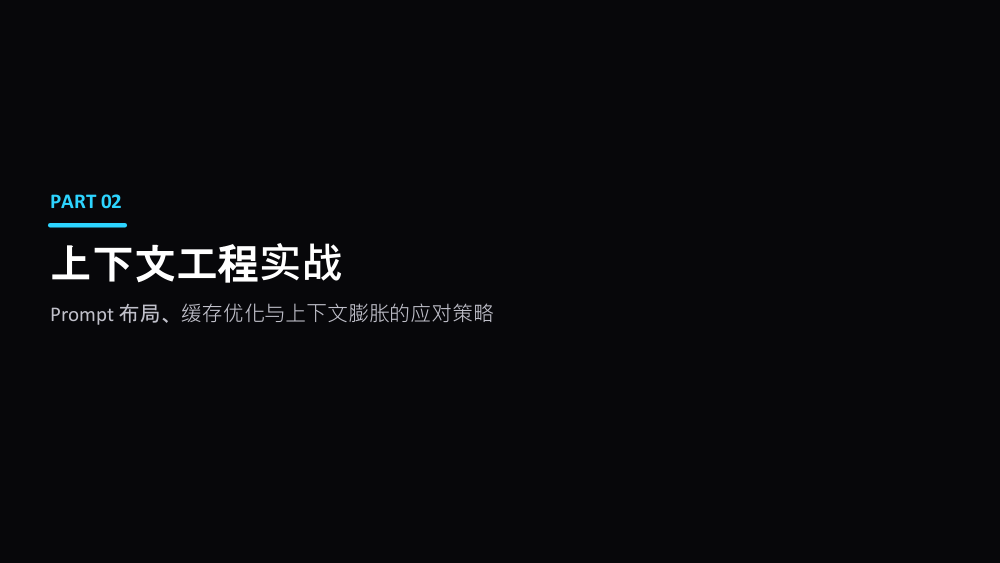

涵盖内容：Prompt 布局、缓存优化与上下文膨胀的应对策略。

不妨大家想一下，今天你在用 AI Coding 的时候，你的工具里面塞了多少上下文？那些上下文是有意义的吗？是增加了你的成本，还是提高了模型对你问题的了解程度？

---

## 一次 Agent 任务背后：Prompt 的五层结构

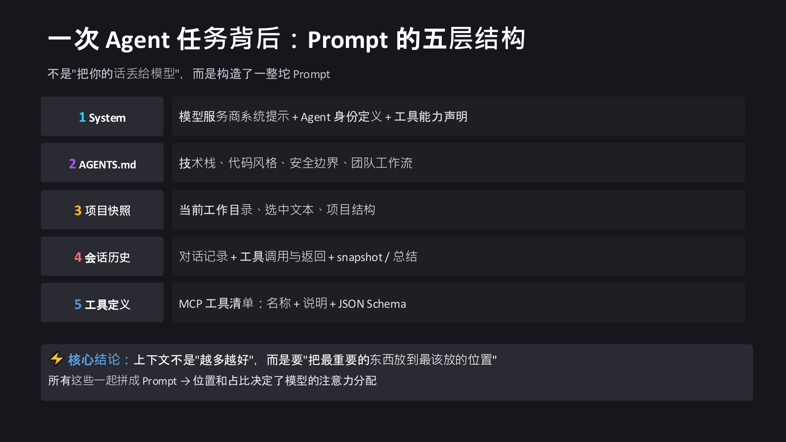

核心是当你在用 AI Coding 产品的时候，你提一个问题，你并不是直接把你的问题放到模型推理了。为什么像 Claude Code 和 Cursor 在使用同样模型的时候有非常不同的表现？核心在于它们的上下文设计。

不是「把你的话丢给模型」，而是构造了一整坨 Prompt：

1. **System**：模型服务商系统提示 + Agent 身份定义 + 工具能力声明
2. **AGENTS.md**：技术栈、代码风格、安全边界、团队工作流
3. **项目快照**：当前工作目录、选中文本、项目结构
4. **会话历史**：对话记录 + 工具调用与返回 + snapshot / 总结
5. **工具定义**：MCP 工具清单：名称 + 说明 + JSON Schema

**核心结论：上下文不是「越多越好」，而是要「把最重要的东西放到最该放的位置」。** 所有这些一起拼成 Prompt → 位置和占比决定了模型的注意力分配。

---

## 记忆的艺术：Compaction + AGENTS.md

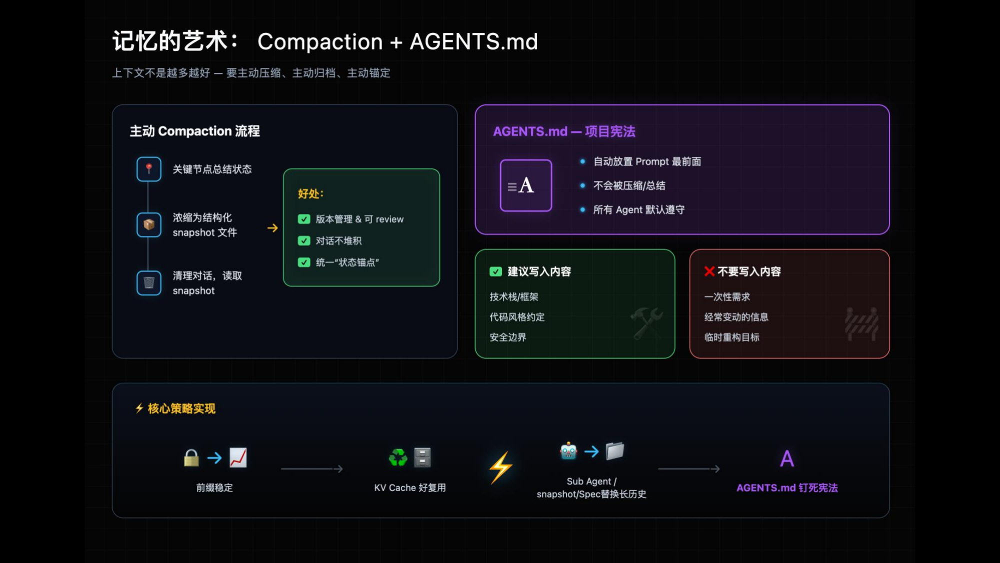

聊到记忆、聊到怎么样管理好上下文，其实业界在这一块确实做了非常多的工作。核心就是：既然上下文窗口不够用，但又有很多信息要暴露给模型，那怎么办？虽然上下文窗口有限，但文件系统的存储大小是非常大的。怎么样把上下文通过压缩放到文件里面来解决问题——这就是现在所有核心产品都在探索的一条路线。

**主动 Compaction 流程**：
- 关键节点总结状态
- 浓缩为结构化 snapshot 文件
- 清理对话，读取 snapshot

好处：版本管理 & 可 review、对话不堆积、统一「状态锚点」。

**AGENTS.md — 项目宪法**：
- 自动放置 Prompt 最前面
- 不会被压缩/总结
- 所有 Agent 默认遵守

建议写入内容：技术栈/框架、代码风格约定、安全边界。不要写入内容：一次性需求、经常变动的信息、临时重构目标。

**核心策略实现**：前缀稳定 → KV Cache 好复用 → Sub Agent / snapshot/Spec 替换长历史 → AGENTS.md 钉死写法。

---

## 抵抗膨胀：将上下文外包给「知识记录系统」

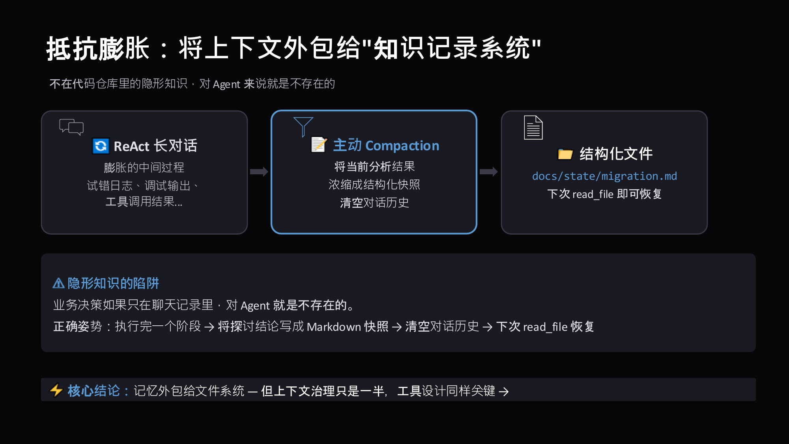

不在代码仓库里的隐形知识，对 Agent 来说就是不存在的。

流程：ReAct 长对话（膨胀的中间过程、试错日志、调试输出、工具调用结果…） → **主动 Compaction**（将当前分析结果浓缩成结构化快照、清空对话历史） → **结构化文件**（docs/state/migration.md，下次 read_file 即可恢复）。

**隐形知识的陷阱**：业务决策如果只在聊天记录里，对 Agent 就是不存在的。正确姿势：执行完一个阶段 → 将探讨结论写成 Markdown 快照 → 清空对话历史 → 下次 read_file 恢复。

**核心结论：记忆外包给文件系统 — 但上下文治理只是一半，工具设计同样关键。**

---

## PART 01-02 CHECKPOINT：到这里，你需要带走的 3 条核心结论

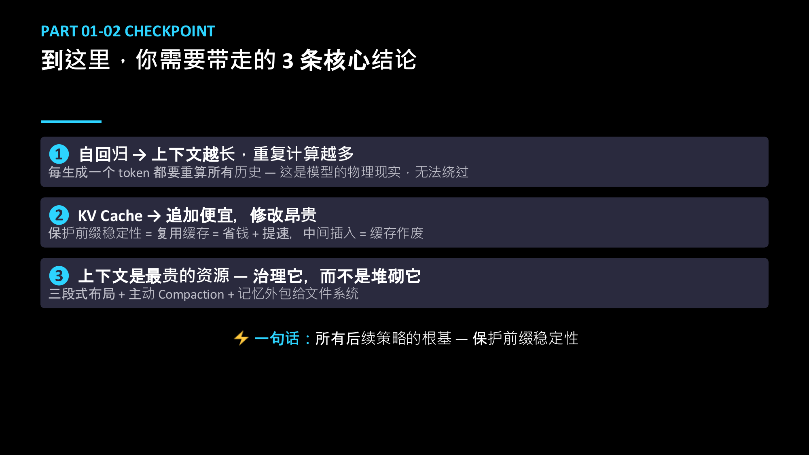

希望大家能够带走这几条核心思路：

1. **自回归 → 上下文越长，重复计算越多**：每生成一个 token 都要重算所有历史 — 这是模型的物理现实，无法绕过。
2. **KV Cache → 追加便宜，修改昂贵**：保护前缀稳定性 = 复用缓存 = 省钱 + 提速，中间插入 = 缓存作废。
3. **上下文是最贵的资源 — 治理它，而不是堆砌它**：三段式布局 + 主动 Compaction + 记忆外包给文件系统。

**一句话：所有后续策略的根基 — 保护前缀稳定性。**

---

## PART 03：工具设计与 Agent 可读性

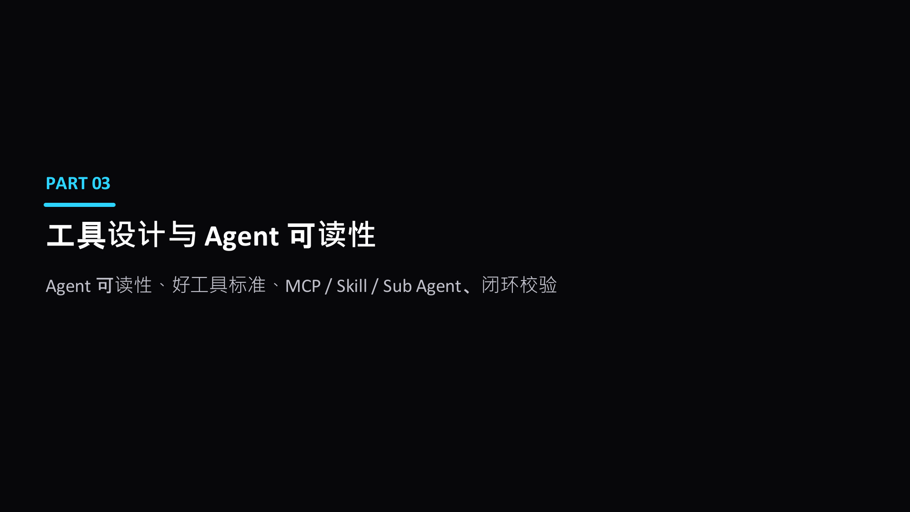

涵盖内容：Agent 可读性、好工具标准、MCP / Skill / Sub Agent、闭环校验。

那什么是好的工具？前面提到了两个关键的点——模型要解决问题需要知道状态，在有状态的情况下，我提供什么工具给它，它才能够解决实际的问题？

---

## 核心范式转移：提升 Agent 可读性

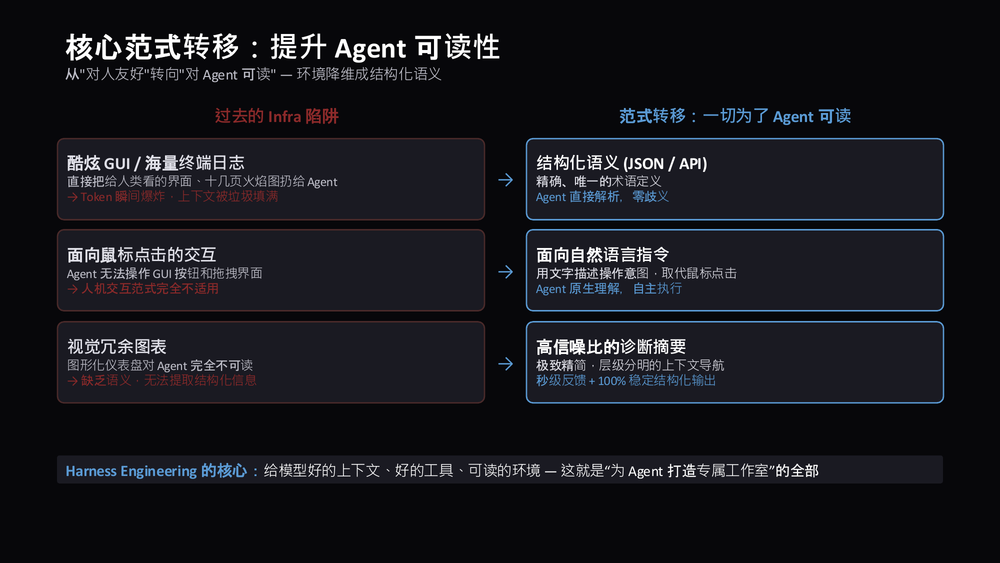

大家都在经历一件非常重要的事情：所有的公司、所有的产品都在做一件事——对 AI 友好。那什么是 AI 友好？

过去互联网时代大家已经积累了非常多的基础设施产品，但这些基础设施有一个非常重要的特点：过去的基础设施提供了大量的 GUI 和海量的日志。这些信息其实并没有办法对模型友好——因为前面提到了你的上下文有限，今天多模态模型又不能很好地真正做到像人一样这么强的泛化能力。

从「对人友好」转向「对 Agent 可读」— 环境降维成结构化语义：

| 过去的 Infra 陷阱 | → | 范式转移：一切为了 Agent 可读 |
|---|---|---|
| 酷炫 GUI / 海量终端日志 | → | 结构化语义 (JSON / API)：精确、唯一的术语定义，Agent 直接解析，零歧义 |
| 面向鼠标点击的交互 | → | 面向自然语言指令：用文字描述操作意图，取代鼠标点击，Agent 原生理解 |
| 视觉冗余图表 | → | 高信噪比的诊断摘要：极致精简，层级分明的上下文导航，秒级反馈 + 100% 稳定结构化输出 |

**Harness Engineering 的核心：给模型好的上下文、好的工具、可读的环境 — 这就是「为 Agent 打造专属工作室」的全部。**

---

## 好工具的标准

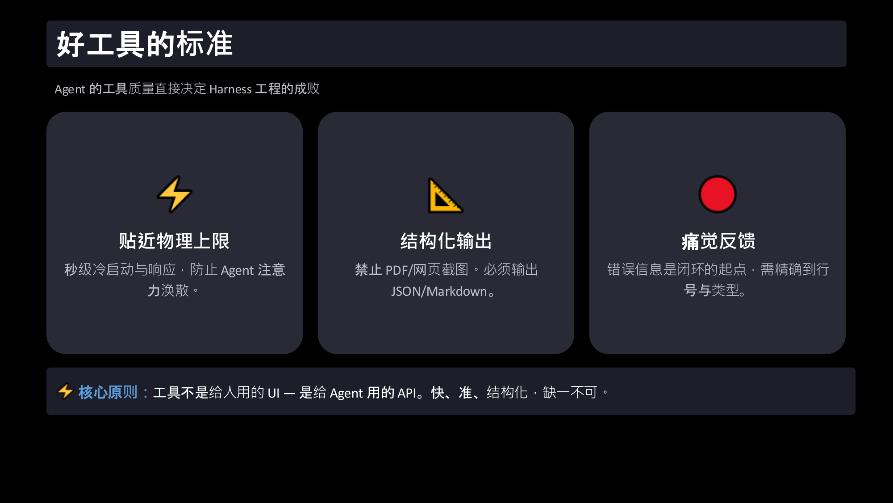

具体来说，对工具来说有三点非常重要：

1. **贴近物理上限**：秒级冷启动与响应，防止 Agent 注意力涣散。我们的工具要足够快，当工具足够快就能给模型更快的反馈。
2. **结构化输出**：禁止 PDF/网页截图，必须输出 JSON/Markdown。当上下文窗口不够的时候，怎么样压缩信息给到模型。
3. **痛觉反馈**：错误信息是闭环的起点，需精确到行号与类型。错误可能比正确更重要——当模型调用工具遇到错误的时候，通过 ReAct 的思想，它基于当前状态来预测下一步行动，告诉它做错了，它通过错误的反馈反而能更接近解决问题。

**核心原则：工具不是给人用的 UI — 是给 Agent 用的 API。快、准、结构化，缺一不可。**

---

## 大脑分工：MCP、Skill 与 Sub Agent

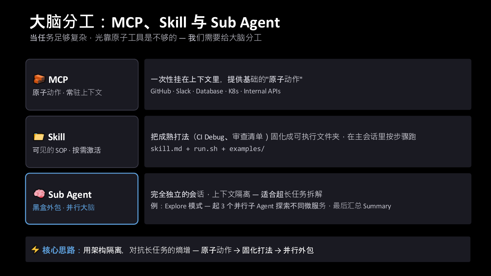

到今天大家会发现，社区上今天出一个想法、明天出一个想法——像 MCP 到 Skill，到底发生了什么？其实核心都没有变，变化的核心只有两点：这个新想法有没有降低 Token 的消耗，并且提升工具的效果？

- **MCP**（原子动作·常驻上下文）：一次性挂在上下文里，提供基础的「原子动作」。GitHub · Slack · Database · K8s · Internal APIs。MCP 出现的核心在于把工具搬到了模型，扩展了模型的工具能力。
- **Skill**（可见的 SOP·按需激活）：把成熟打法（CI Debug、审查清单）固化成可执行文件夹，在主会话里按步骤跑。skill.md + run.sh + examples/。Skill 的核心是告诉模型你怎么样来用这些工具——相当于把领域知识直接交给了模型，并且是渐序式加载，降低了上下文窗口消耗。
- **Sub Agent**（黑盒外包·并行大脑）：完全独立的会话，上下文隔离 — 适合超长任务拆解。例：Explore 模式 → 一起 3 个并行子 Agent 探索不同微服务，最后汇总 Summary。既然上下文窗口不够，我没办法在同一个上下文里解决所有问题，就把子任务交给 Sub Agent 来解决。

**核心思路：用架构隔离，对抗长任务的熵增 — 原子动作 → 固化打法 → 并行外包。**

---

## 闭环校验与编辑：机器人的 LSP

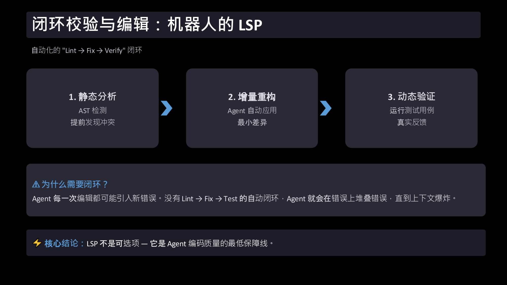

LSP 我认为是一个非常关键的工具，它深度地体现了什么是好工具的标准。当大家在使用 AI Coding 的时候，在你没有给它接入 LSP 的时候会发生什么？你会发现原来人能看到的很多东西，为什么我的 AI Coding 看不到呢？因为它的上下文里面根本感知不到什么地方报错了。LSP 能够把原来人看到的东西——例如我的语法高亮了红色了，我知道它报错了——给 Agent 用了之后，模型就知道哪里有问题，能动态地去修。

自动化的 "Lint → Fix → Verify" 闭环：

1. **静态分析**：AST 检测、提前发现冲突
2. **增量重构**：Agent 自动应用、最小差异
3. **动态验证**：运行测试用例、真实反馈

**为什么需要闭环？** Agent 每一次编辑都可能引入新错误。没有 Lint → Fix → Test 的自动闭环，Agent 就会在错误上堆叠错误，直到上下文爆炸。

**核心结论：LSP 不是可选项 — 它是 Agent 编码质量的最低保障线。**

---

## PART 04：多智能体协作与受控执行

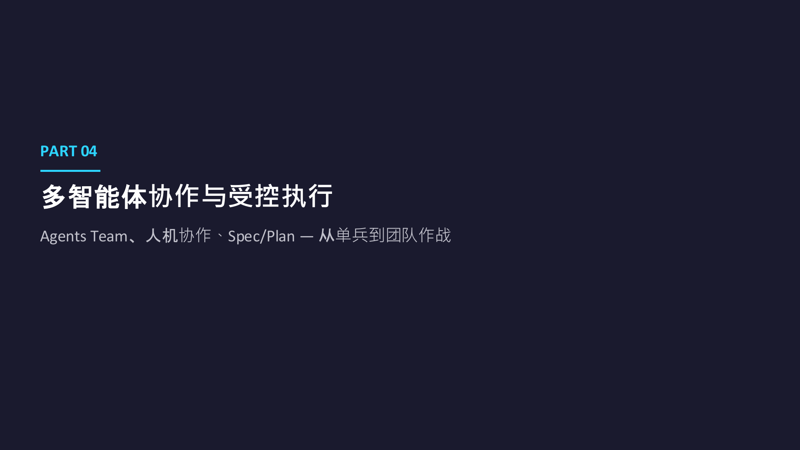

涵盖内容：Agents Team、人机协作、Spec/Plan — 从单兵到团队作战。

大家都在做一些尝试，或者说想把一些开发规范搬到自己的研发工作流里面。那离不开两套思想——Spec Kit 和人机协作。

---

## Spec Kit 与 Plan 模式：谋定而后动

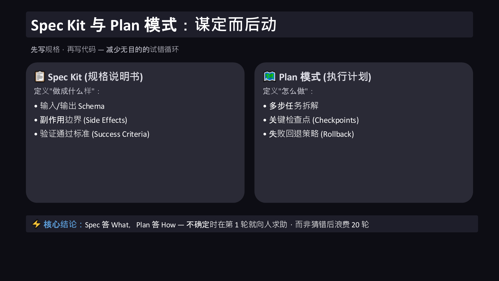

核心就是在 Agent 真正去干活之前，你先把问题给我讲清楚了，我确认你这个问题是没问题的，然后我再去干。

先写规格，再写代码 — 减少无目的的试错循环：

- **Spec Kit (规格说明书)**：定义「做成什么样」— 输入/输出 Schema、副作用边界 (Side Effects)、验证通过标准 (Success Criteria)
- **Plan 模式 (执行计划)**：定义「怎么做」— 多步任务拆解、关键检查点 (Checkpoints)、失败回退策略 (Rollback)

**核心结论：Spec 答 What，Plan 答 How — 不确定时在第 1 轮就向人求助，而非猜错后浪费 20 轮。**

---

## 人机协作：Agent 何时该自主，何时该求助

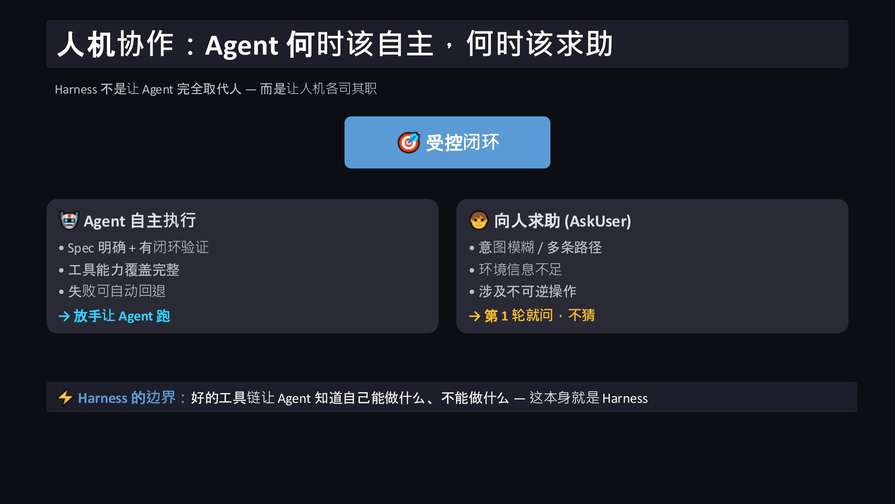

现在所有 Agent 产品都在探索：既然模型这么强大了，那人的必要性还有吗？肯定是有的，因为人本身就是最强大泛化的一个工具。怎么样在现有的产品里面把人的作用利用起来，这是非常关键的问题。

Harness 不是让 Agent 完全取代人 — 而是让人机各司其职：

**Agent 自主执行**（当条件满足时放手让 Agent 跑）：
- Spec 明确 + 有闭环验证
- 工具能力覆盖完整
- 失败可自动回退

**向人求助 (AskUser)**（第 1 轮就问，不猜）：
- 意图模糊 / 多条路径
- 环境信息不足
- 涉及不可逆操作

大家在使用 AI Coding 的时候会发现，它要么经常问你问题导致流程卡住，要么就是不问你——这都说明这些产品还有很大的提升空间。它到底该什么时候问你，以及问了之后是不是真正关键的问题？

**Harness 的边界：好的工具链让 Agent 知道自己能做什么、不能做什么 — 这本身就是 Harness。**

---

## 突破智能上限：Agents Team 与结构化通信

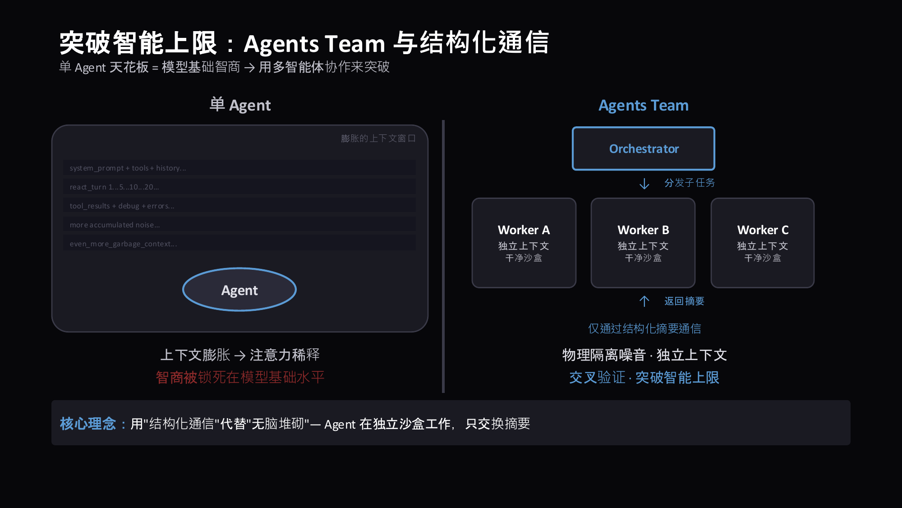

刚才聊到上下文窗口是有限的，怎么样突破这个上限？因为 Transformer 的自回归模型预测下一个 Token，当你的上下文窗口达到一定限制之后，你会发现模型变得越来越笨了。核心在于，当上下文越长，模型对前面上下文的遗忘更加明显。

怎么解决？我一个 Agent 不行，那我是不是可以把注意力释放、交给其他人来做——这在人类社会里面是非常常见的。既然作为老板管不了那么多事情，那我把子任务分配给子 Agent 来解决。

**单 Agent** 天花板 = 模型基础智商 → 上下文膨胀 → 注意力稀释 → 智商被锁死在模型基础水平。

**Agents Team**：Orchestrator 分发子任务 → Worker A / B / C 各自独立上下文、干净沙盒 → 仅通过结构化摘要通信 → 物理隔离噪音·独立上下文，交叉验证·突破智能上限。

**核心理念：用「结构化通信」代替「无脑堆砌」— Agent 在独立沙盒工作，只交换摘要。**

---

## 回想一下

上次让 Agent 跑一个超过 20 轮的任务，它在第几轮开始「变笨」？

接下来看看我们的工程化解法 — 如何让 Agent 稳定跑完全程。

---

## PART 05：释放人类注意力 & 构建 AI Native 工具

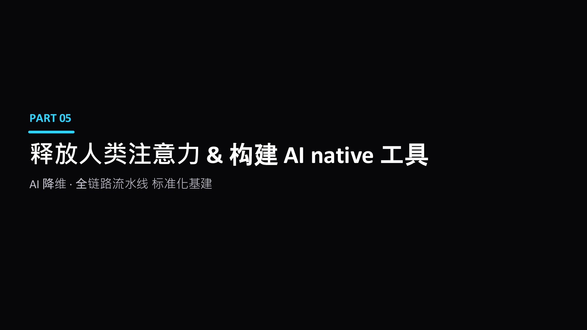

涵盖内容：AI 降维 · 全链路流水线标准化基建。

大家都知道每个人每天只有 24 小时，真正能够用来工作的时间是很有限的。但今天 AI 产品可以实时刻刻地在工作，并且一个人可以用几十个 AI 产品。这个时候大家就关注到一个现象：AI 产品能干这么多活，但我自己的注意力是有限的，那怎么解决这个问题？

---

## 基于 Agent 的 CLI 自迭代端到端闭环

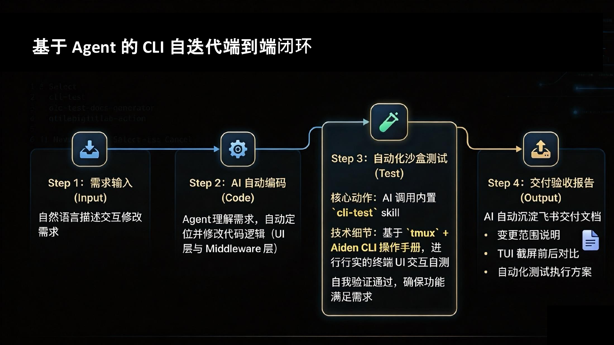

大家过去在使用 AI 产品的时候为什么觉得自己很累？原因第一个就是你只让 AI Coding 写代码，但没有让它帮你交付产品。

具体来说怎么做？说一下我自己的实践——我在公司的产品里做一个 AI 产品，形态跟 Claude Code 差不多：

- **Step 1：需求输入 (Input)** — 自然语言描述交互修改需求
- **Step 2：AI 自动编码 (Code)** — Agent 理解需求，自动定位并修改代码逻辑（UI 层与 Middleware 层）
- **Step 3：自动化沙盒测试 (Test)** — 核心动作：AI 调用内置 `cli-test` skill，基于 `tmux` + Aiden CLI 操作手册进行行行实的终端 UI 交互自测，自我验证通过，确保功能满足需求
- **Step 4：交付验收报告 (Output)** — AI 自动沉淀飞书交付文档：变更范围说明、TUI 截屏前后对比、自动化测试执行方案

关键转变：AI 帮我把代码改完了，那谁来验收？当然还是得 Agent 来验收——因为我没有那么多时间，我的注意力是有限的，但 Agent 的注意力是无限的。核心就是让 AI 写完代码之后，通过各种工具去帮你验收。人到最后只需要审阅：你帮我改了什么东西、前后发生了什么变化、你增加了什么测试来确保稳定性。

---

## 从 Review 代码到 Review 交互和测试

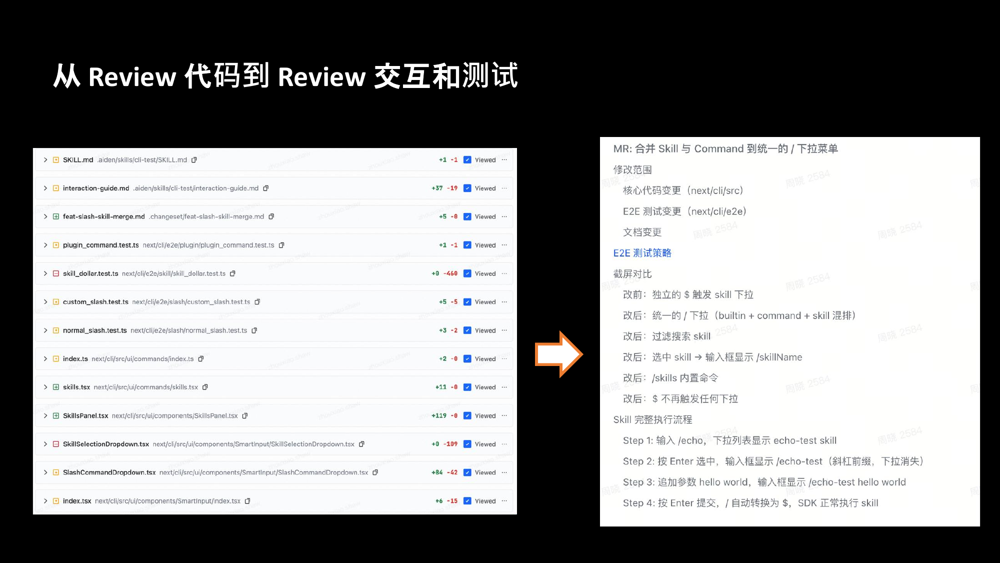

这里聊一个非常大的转变——大家一定要有一个深刻的认知：人的注意力是有限的，现在 AI Review 代码的流程是不是应该也发生变化？答案是必然需要。

过去一段时间对我来说有个非常大的困扰：每天需要 Review 大量的 MR（Merge Request）。那如果我不 Review 但又不放心大家的代码直接上线，我也有点焦虑。

解决思路就是：**我不 Review 代码，我只 Review 交付产物** — 你的单元测试有没有覆盖关键的 Case？你的上线是不是稳定的？

举一个非常简单的例子：前两周我们对齐了一个 Claude Code 的功能——Skill 触发相关功能。我给我的 AI 下达了一个指令：希望你去对齐 Claude Code Skill 触发的相关功能，并且给我产出一份非常详细的报告。它就直接告诉我了结果——已经把交互变成了钢性地交给我，我只需要审阅结果，而不是去审阅一堆代码。

---

## 端到端闭环交付，Aiden CLI

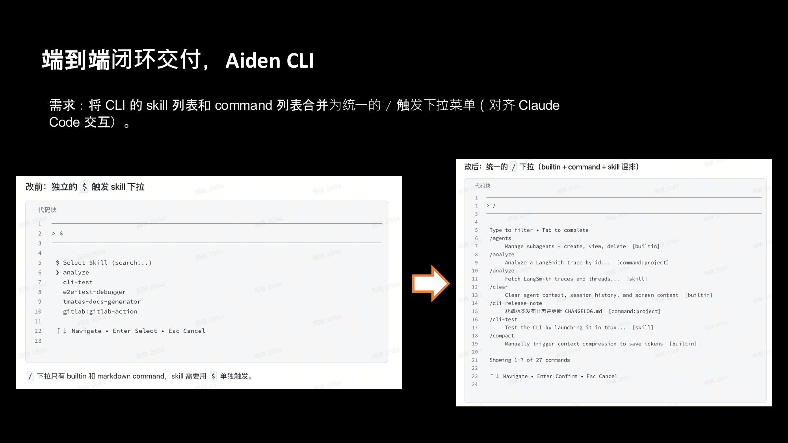

需求：将 CLI 的 skill 列表和 command 列表合并为统一的 / 触发下拉菜单（对齐 Claude Code 交互）。

改前：独立的 $ 触发 skill 下拉，/ 下拉只有 builtin 和 markdown command，skill 需要用 $ 单独触发。

改后：统一的 / 下拉（builtin + command + skill 混排），过滤搜索 skill，选中 skill → 输入框显示 /skillName，/skills 内置命令，$ 不再触发任何下拉。

---

## Midscene.js: 为 Agent 打造 AI Native 的工具

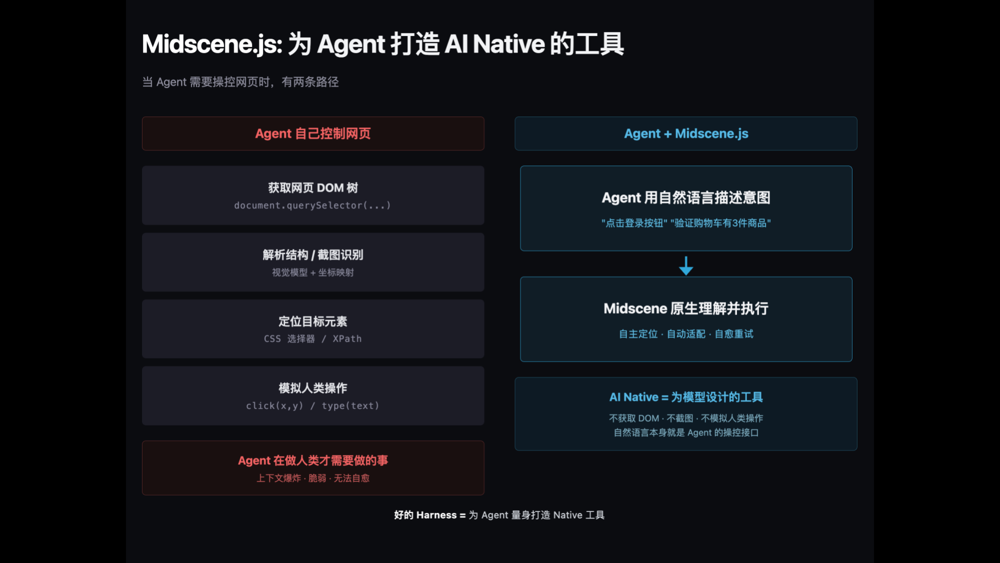

大家会想：我到底怎么落地？什么工具才是 AI 原生的？我以 Midscene.js 为例。

过去大家都在做一些事情——希望 AI 帮自己把代码改完之后，自己打开网页看一看改动到底有没有生效。你会发现现在所有产品都在把 Playwright 接进来、把能直接控制浏览器的工具接进来。但这都有一个问题：不太符合怎么样用更少的 Token、更少的上下文去解决问题。

传统网页操作：先获取 DOM 树 → 解析截图识别 → 定位目标元素 → 模拟人类操作。你这么一通操作下来，还没真正开始干活，上下文就已经消耗了三四万 Token。

**Agent + Midscene.js 的解法**：Agent 用自然语言描述意图（「点击登录按钮」「验证购物车有 3 件商品」），Midscene 原生理解并执行 — 自主定位、自动适配、自愈重试。

**AI Native = 为模型设计的工具**：不获取 DOM、不截图、不模拟人类操作，自然语言本身就是 Agent 的操控接口。所有动作都封装到 Midscene 里面，意味着 Token 有明显的下降，效果也有非常大的提升。

**好的 Harness = 为 Agent 量身打造 Native 工具。**

---

## 从「模拟人类」到「AI Native」：重塑 Agent 开发全链路闭环

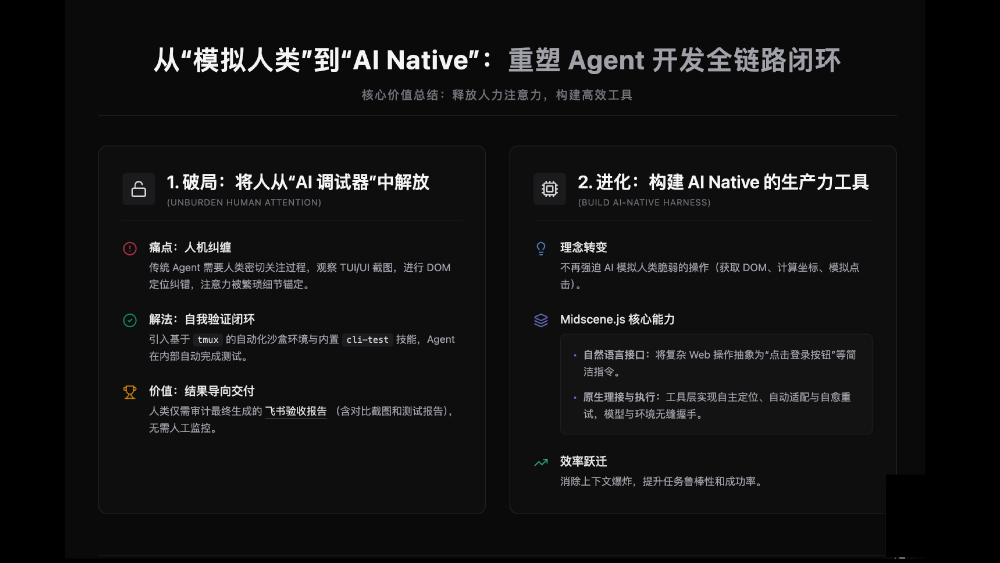

核心价值总结：释放人力注意力，构建高效工具。

**1. 破局：将人从「AI 调试器」中解放 (Unburden Human Attention)**

- 痛点：人机纠缠 — 传统 Agent 需要人类密切关注过程，观察 TUI/UI 截图，进行 DOM 定位纠错，注意力被繁琐细节锁定。
- 解法：自我验证闭环 — 引入基于 tmux 的自动化沙盒环境与内置 cli-test 技能，Agent 在内部自动完成测试。
- 价值：结果导向交付 — 人类仅需审计最终生成的飞书验收报告（含对比截图和测试报告），无需人工监控。

**2. 进化：构建 AI Native 的生产力工具 (Build AI-Native Harness)**

- 理念转变 — 不再强迫 AI 模拟人类脆弱的操作（获取 DOM、计算坐标、模拟点击）。
- Midscene.js 核心能力：自然语言接口（将复杂 Web 操作抽象为「点击登录按钮」等简洁指令）、原生理解与执行（工具层实现自主定位、自动适配与自愈重试，模型与环境无缝握手）。
- 效率跃迁 — 消除上下文爆炸，提升任务鲁棒性和成功率。

---

## 总结与展望：AI 时代的研发新范式

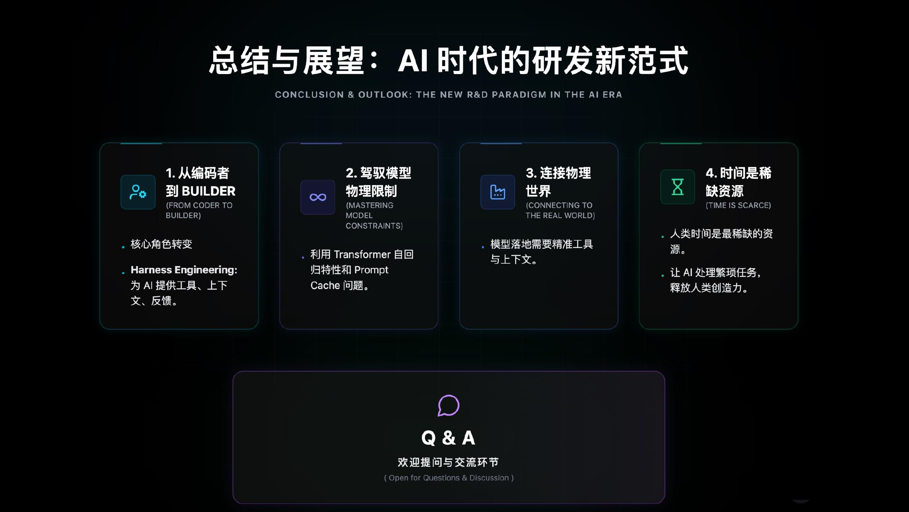

最后做一下今天分享的总结。大家现在都非常焦虑——我作为开发者在今天这个时代应该怎么样？大家不得不面临一个现实：如果你只做一个编码者，那在今天 AI 能够干十个人活的时候，你写代码的价值确实在急速下降。那我们必须要做转变。

**四个核心方向：**

1. **从编码者到 Builder**：核心角色转变。Harness Engineering — 为 AI 提供工具、上下文、反馈。
2. **驾驭模型物理限制**：利用 Transformer 自回归特性和 Prompt Cache 问题。模型只是一个巨大的函数、一个参数——当你了解这些边界之后，你会发现没那么焦虑了。
3. **连接物理世界**：模型落地需要精准工具与上下文。它怎么样影响物理世界，取决于我给它提供了什么状态、什么工具。
4. **时间是稀缺资源**：人类时间是最稀缺的资源。让 AI 处理繁琐任务，释放人类创造力。

> 到这里我的分享就结束了，谢谢大家！

---

## Q & A 环节精选

**Q：AI 产生很多文件变更（几十个变更），你只关心单测和测试结果有没有覆盖到，但怎么让整个代码架构朝着合适的方向前进，而不是因为 AI 的变更导致代码不好维护？**

**A：** 这个问题我相信大家可能都比较感同身受。这里我要呈现两个点：

第一，今天大家所认为的标准是不是真的合理？比如 AI 给你一个文件写了两三千行代码，对人来说这好像是一个难以接受的事情——因为没有哪一个同事会给你写个两三千行的一个文件出来。但我们需要有新的定义，不是局限于过去人该怎么做那今天 AI 就怎么做，核心点在于这件事情对 AI 来说是不是合理的。

第二，既然今天 AI 改了这么多代码，但我并不相信它只跑一次单测就能够把我所关心的问题覆盖到。这也是为什么到今天 AI 并没有造成大规模的失业，因为今天这个差距确实存在——像 Midscene.js 这样的产品解决了端到端测试，但我们的产品在变更之后有没有性能劣化？有没有内存增长？这些都是大家需要深度思考的问题。

我理解这也是机会所在——今天为什么 AI 写完代码之后没有帮你把剩下的工作搞定？这不就是大家的机会吗？这个机会会诞生非常多有价值的公司以及非常有价值的产品。我相信在座的各位都有机会把 AI 没干完的活更好地解决。
